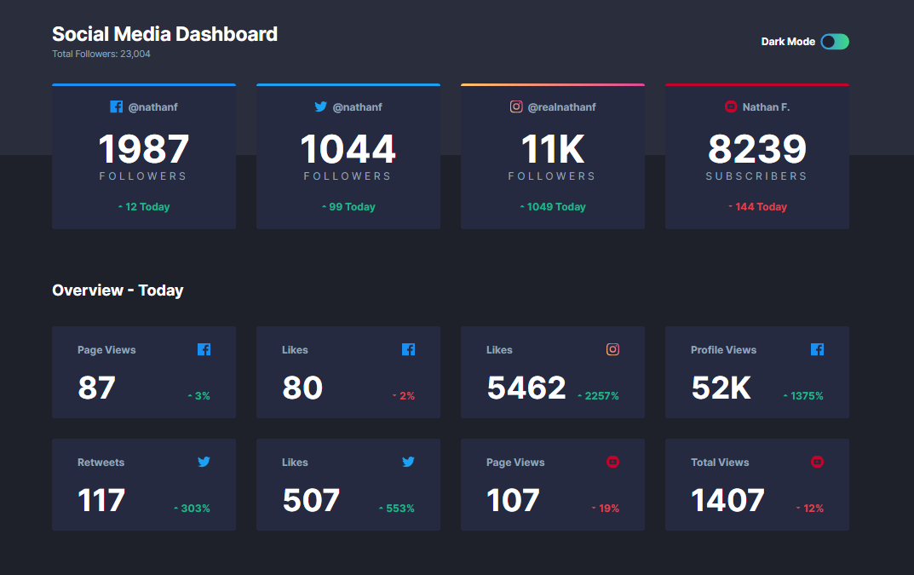

# Frontend Mentor - Social media dashboard with theme switcher solution

This is a solution to the [Social media dashboard with theme switcher challenge on Frontend Mentor](https://www.frontendmentor.io/challenges/social-media-dashboard-with-theme-switcher-6oY8ozp_H). Frontend Mentor challenges help you improve your coding skills by building realistic projects. 

## Table of contents

- [Overview](#overview)
  - [The challenge](#the-challenge)
  - [Screenshot](#screenshot)
  - [Links](#links)
- [My process](#my-process)
  - [Built with](#built-with)
  - [Useful resources](#useful-resources)
- [Author](#author)

## Overview

### The challenge

Users should be able to:

- View the optimal layout for the site depending on their device's screen size
- See hover states for all interactive elements on the page
- Toggle color theme to their preference

### Screenshot

### Links

- Solution URL: [Add solution URL here](https://github.com/NoufelLalmi/SM-Dashboard)
- Live Site URL: [Add live site URL here](https://noufellalmi.github.io/SM-Dashboard/)

## My process

### Built with

- Semantic HTML5 markup
- CSS custom properties
- Flexbox
- CSS Grid
- [Tailwind css](https://tailwindcss.com/) - For styles

### Useful resources

- [Youtube video](https://www.youtube.com/watch?v=9lTdR_5jaH0) - This helped me alot. I really liked this pattern and recommend for arabic speakers.
- [How to make a Toggle](https://devcamp.com/trails/javascript-in-the-browser/campsites/javascript-dom/guides/how-to-use-javascript-s-toggle-function) - This is an amazing article which helped me finally understand how to add event lister and toggle the the checkbox element to swich easy between the modes. I'd recommend it to anyone still learning this concept.
## Author

- Website - [Noufle Lalmi](https://lalminoufle-portfolio.netlify.app/)
- Frontend Mentor - [@NoufelLalmi](https://www.frontendmentor.io/profile/yourusername)
- Twitter - [@noufellalmi](https://www.twitter.com/yourusername)
